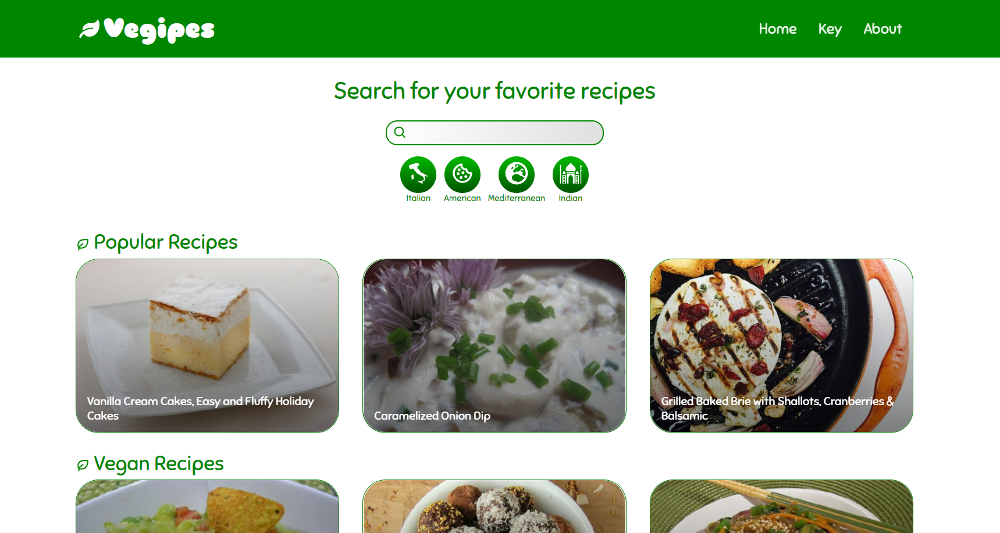

<!-- Intestazione -->

<h1 style='color:green'>Vegipes</h1>

 

<!-- Sommario -->

  
Table of Contents

  <ol>
    <li><a href="#about-the-project">About the project</a></li>
    <li><a href="#built-with">Built with</a></li>
    <li><a href="#components">JavaScript components</a>
      <ul>
        <li><a href="#add-functions">Add functions</a></li>
      </ul>
    <li><a href="#usage">Usage</a>
    </li>
  </ol>

 

<!-- Informazioni sul progetto -->
## About the project

The site is very simple and allows you to search through many vegetarian recipes. All recipe data are fetched by [Spoonacular](https://spoonacular.com/food-api) API. Therefore it is possible that the daily requests made with my key can be exhausted. In this case a section has been created in which you can insert your key.

(<a href="#top">back to top</a>)

 
