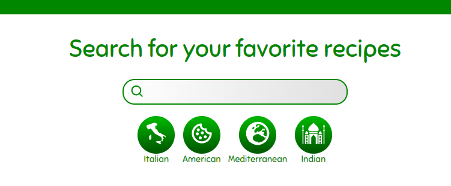
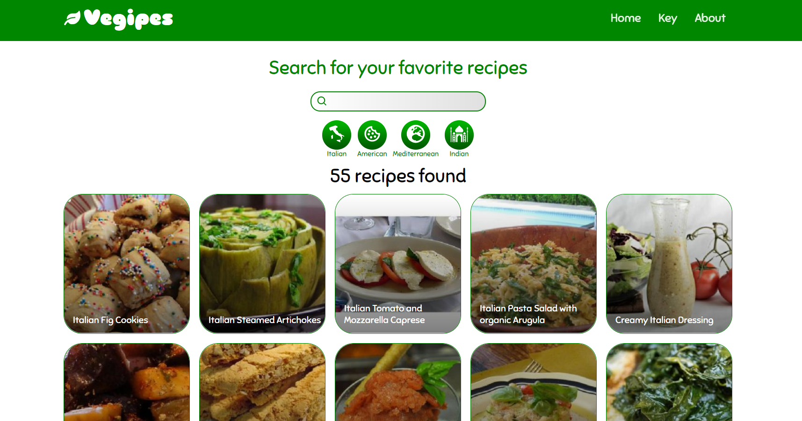
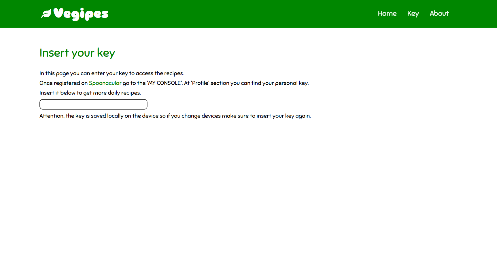

<!-- Intestazione -->

  

    
    <h1>Vegipes</h1>
  

 

<!-- Sommario -->

  
Table of Contents

  <ol>
    <li><a href="#about-the-project">About the project</a></li>
    <li><a href="#built-with">Built with</a></li>
    <li><a href="#react-features">React features</a></li>
    <li><a href="#API-management">API management</a></li>
    <li><a href="#link">Link</a></li>
  </ol>

 

<!-- Informazioni sul progetto -->
## About the project

The site is very simple and allows you to search through many vegetarian recipes. All recipe data are fetched by <a href='https://spoonacular.com/food-api'>Spoonacular</a> API. Therefore it is possible that the daily requests made with my key can be exhausted. In this case a section has been created in which you can insert your key.

(<a href="#top">back to top</a>)

 

<!-- Coustruito con -->
## Built with
* [JavaScript](https://www.javascript.com/)
* [React](https://reactjs.org/)
* [Sass](https://sass-lang.com/)
* [Netlify](https://www.netlify.com/)

(<a href="#top">back to top</a>)

 

<!-- React -->
## React features

The pages and components of the app create a simple and intuitive page design. On the main page are shown the most popular recipes along with some vegan proposal. Also below the search bar are buttons with some of the hottest food categories.

Once clicked on one of the categories will be shown all the richness in the database that correspond to that cuisine.

(<a href="#top">back to top</a>)

 

<!-- API -->
## API management

Daily requests for access to recipes are limited. To overcome this problem some data is saved locally when the page is loaded. Also there is the possibility, once registered on <a href='https://spoonacular.com/food-api'>Spoonacular</a>, to enter your key to have more access to the data.

(<a href="#top">back to top</a>)

 

<!-- Link -->
## Link
* [Vegipes](https://vegipes.netlify.app)

(<a href="#top">back to top</a>)

